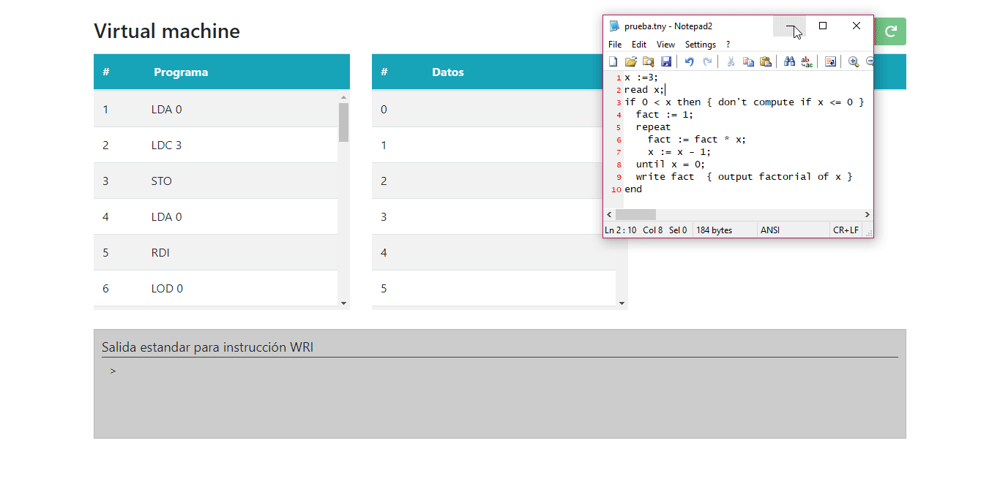

<p align="center">
  
</p>

# Compilador TINY a P-Code y Máquina Virtual para ejecutar P-Code.

## Compilador
El compilador está programado en JAVA y hace uso del generador léxico **JFlex** junto con el generador sintáctico **CUP**. Está diseñado de una manera sencilla para el entendimiento básico sobre los compiladores. Este compilador está basado en un compilador Tiny que genera codigo Tiny Machine (TM). 

Inicialmente, el compilador base solo permitía instrucciones de suma, resta, multiplicación, división, comparación (igual a y menor que), condiciones, un ciclo básico, y lectura y escritura de valores. Esta versión incluye soporte para vectores y funciones (sin recursividad). 

Dentro de las especificaciones léxicas se encuentran: 


| Palabras Reservadas    | Símbolos Especiales     | Otros                       |
| -----------------------|:-----------------------:|-----------------------------|
| if                     | +                       | Números enteros             |  
| then                   | -                       | Identificadores (variables) |
| else                   | *                       | Vectores con índices enteros|
| end                    | /                       | Funciones con retorno       |
| repeat                 | =                       |                             |
| until                  | <                       |                             |
| read                   | (                       |                             |
| write                  | )                       |                             |
| function               | ;                       |                             |
| return                 | :=                      |                             |
| vector                 | ,                       |                             |
|                        | [                       |                             |
|                        | ]                       |                             |

Cada variable debe ser declarada antes de ser usada en una de las siguientes operaciones:
* Al lado derecho de las asignaciones
* Como parámetro de una función 
* Como índice de un vector

Cada vector debe ser declarado antes de ser usado, y presentan el formato **vector A n**, siendo **vector** la palabra reservada, **A** el nombre del vector y **n** el tamaño del vector en entero.

Las funciones siempre retornarán un valor. El paso de parametros en las funciones es por valor.

> Para el código fuente es importante resaltar que la última sentencia de cada bloque NO DEBE LLEVAR PUNTO Y COMA ";"

Por ejemplo: 
```python
x:=3; { Bloque 1 }
vector A 10; { Bloque 1 }
read x; { Bloque 1 }
A[2+x]:=1; { Bloque 1 }
if(x > 0) { Bloque 1 }
then 
  write x { Bloque 2 }
end;
write A[2+x] { Bloque 1 }
```

Cada regla gramatical tiene su respectiva clase definida para actuar como un nodo. Los objetos de dichas clases (nodos) almacenan y relacionan la información correspondiente desde el parser (analizador sintáctico). El parser aplica las reglas de manera ascendente (análisis LR) y arma el árbol sintáctico (usando los nodos declarados). Una vez acabado el análisis sintáctico, se realiza un recorrido preorden para insertar los identificadores de variables, funciones y vectores en la tabla de símbolos. Luego de realizar estas tareas, el compilador procede a generar el código P en un recorrido preorden, usando funciones para cada tipo de sentencia, las cuales a su vez usan recursivamente otras funciones generadoras de código que van completando las instrucciones correspondientes en código P. La generación de código para la declaración de funciones es realizada al final. Después de esto, el compilador realiza una última pasada para reemplazar las etiquetas (labels) con los respectivos números de instrucción a los cuales identifica.

Las reglas semánticas implementadas son las siguientes:
* Declaración de identificadores, funciones y vectores, antes de ser usados.
* Comparaciones incorrectas que se puedan dar en el índice de un vector. Ejemplo: ```A[(x<0)]``` ó ```A[(x=0)]```

El código P generado es escrito en un archivo con extensión **.pcod** que es indicado antes del inicio de la compilación. (si no se indica, el compilador generara el archivo en la misma ubcación que el archivo fuente, con extensión .pcod)

## Máquina Virtual P-Code
Es un programa desarrollado en HTML/CSS/JavaScript que permite simular la ejecución del Código P. 
Cuenta con tres estructuras de almacenamiento: una memoria de datos, una memoria de instrucciones
y una pila.

- Pila: La pila permite almacenar temporalmente datos para realizar operaciones.
- Instrucciones: Arreglo de instrucciones en código P sacadas del programa fuente a ejecutar, con sus argumentos
- Datos: Arreglo para almacenar datos.
### Interfaz Grafica 
Además de los arreglos mencionados previamente, la máquina virtual cuenta con un ``toolbar`` que permite ejecutar
cada instrucción paso a paso, detener la ejecución o reiniciarla.
Cuenta con un ``panel de salida`` por el cual se muestran valores con la instrucción WRI. Los errores aparecen en la
parte superior con un alert rojo.

La VM acepta archivos de texto en formato .txt y .pcod.

### Listado de instrucciones en código P

Listado de instrucciones que soporta actualmente la máquina virtual.

**Instrucción**|**Descripción**|**Nota**
|:-----:|---------------------------------------------------------------------------------------------------------------------------------------------------------------------------------------------------------------------------------------------------------------------------------------------------------------------------------------------------|--------------------------------------------------------------------------------------------------------------------------------------------------------|
|LDA X  |Pone la dirección de X en el tope de la pila. X es la dirección de la variable.| 
|LOD X  |Pone el valor de X en el tope de la pila. X es la dirección de la variable| 
|LDC N  |Pone la constante N en el tope de la pila. | 
|STO    |Guarda el valor del tope de la pila en la dirección de datos que se encuentra debajo del tope. Ambos valores son removidos.| 
|STN    |Igual a STO, pero coloca el valor devuelta al tope de la pila. La dirección es removida.| 
|STP    |Detiene la ejecución de la instrucción. Marca el fin del programa.| 
|RDI    |Lee un valor de la entrada estándar. Pone el valor en la dirección de memoria que se encuentre en el tope de la pila. El tope de la pila es removido.| 
|WRI    |Emite el valor que se encuentre en el tope de la pila a la salida estándar. El valor es removido de la pila.| 
|ADI    |Extrae dos valores de la pila, los suma y pone el resultado en el tope de la pila. |A + B, donde B es el tope de la pila.|
|SBI    |Extrae dos valores de la pila, los resta y pone el resultado en el tope de la pila.|A – B, donde B es el tope de la pila.|
|MPI    |Extrae dos valores de la pila, los multiplica y pone el resultado en el tope de la pila.|A * B, donde B es el tope de la pila.|
|DVI    |Extrae dos valores de la pila, los divide y pone el resultado  (parte entera sin el decimal) en el tope de la pila.|A / B, donde B es el tope de la pila.|
|EQU    |Igual a. Extrae dos valores de la pila, y compara si son iguales. Coloca 0 (falso) o 1 (verdadero) en el tope de la pila.| 
|GRT    |Mayor que. Extrae dos valores de la pila, y los compara. Coloca 0 (falso) o 1 (verdadero) en el tope de la pila.|A > B, donde B es el tope de la pila.|
|LAB L  |Define una etiqueta L. Marca esta instrucción como punto objetivo para un salto.|L es el número o dirección de la instrucción en la memoria de instrucciones.|
|UJP L  |Salto incondicional hacia la instrucción con etiqueta L. Coloca PC igual a L – 1.|L es el número o dirección de la instrucción en la memoria de instrucciones.|
|FJP L  |Salto condicional. Extrae el valor del tope de la fila, si es 0 (falso) salta a la instrucción con etiqueta L. Coloca PC igual a L – 1.|L es el número o dirección de la instrucción en la memoria de instrucciones.|
|IND i  |Extrae la dirección que se encuentra en el tope de la pila, y la desplaza i direcciones. Coloca el valor de la nueva dirección en el tope de la pila.| 
|IXA d  |Desplaza una dirección de memoria usando un factor de escala. Toma como parámetro el factor de escala entero. Extrae del tope de la pila la cantidad a desplazar (i). La dirección se debe encontrar debajo del tope de la pila (a). Remueve de la pila tanto el desplazamiento como la dirección. Coloca en el tope de la pila la nueva dirección calculada.|D = a + (i * d). Donde D es la nueva dirección, a la dirección a desplazar, i la cantidad a desplazar, y del factor de escala.|
MST     |Mark Stack. Marca el comienzo de la declaración de los valores de los argumentos. Además, coloca el apuntador MP igual a SP, para indicar el comienzo de la pila para el procedimiento a ser llamado.| 
CUP LP  |Instrucción de llamada a procedimiento. Pone en la pila el valor actual de PC, para luego ser usada como dirección de retorno. Luego salta a la instrucción LP (comienzo del procedimiento). Coloca PC igual a IF – 1.|LP es el número o dirección de la instrucción (comienzo del procedimiento) en la memoria de instrucciones.
ENT DP  |Instrucción de entrada al procedimiento. El parámetro DP es la dirección (en memoria de datos) del identificador del procedimiento. Esta instrucción extrae el tope de la pila (dirección de retorno) y luego extrae de la pila los argumentos hasta que MP sea igual a SP (final de la pila del procedimiento). Carga los valores de los argumentos en sus respectivas direcciones usando DP como dirección base. Al final vuelve a colocar en la pila la dirección de retorno para ser usada más adelante.|DP es la dirección del procedimiento en la memoria de datos.|
RET     |Instrucción de retorno del procedimiento. Extrae de la pila el valor a ser retornado, luego extrae la dirección de retorno que se encuentra al final de la pila del procedimiento (MP). Usa dicha dirección para emitir un salto a donde el procedimiento fue llamado, y coloca nuevamente el valor de retorno en el tope de la pila.| 

<br>
<br>

### Demo

Demostración de la simulación del programa ejemplo ubicado en el repositorio en ``demo/ejemplo.p``

